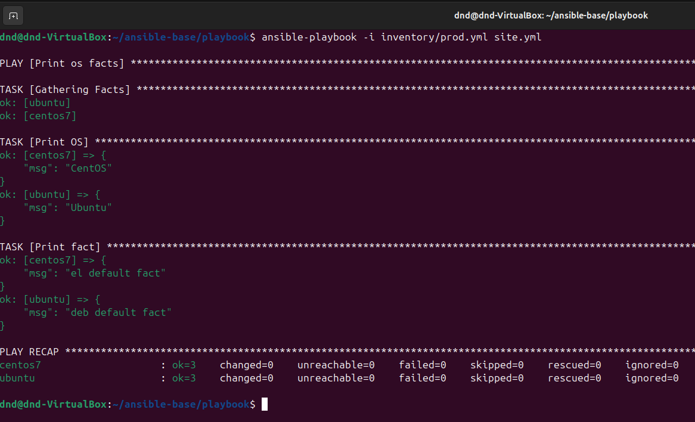
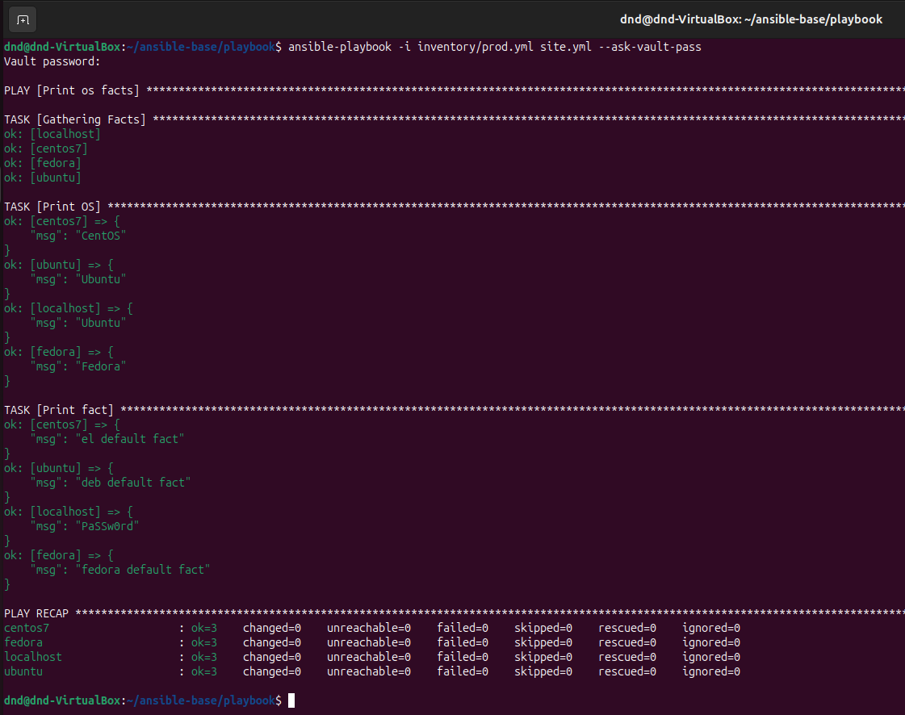

# Домашнее задание к занятию "`Введение в Ansible`" - `Дедюрин Денис`

---
## Задание.

0. Установите Ansible версии 2.10 или выше.

## Основная часть

1. Попробуйте запустить playbook на окружении из `test.yml`, зафиксируйте значение, которое имеет факт `some_fact` для указанного хоста при выполнении playbook.
2. Найдите файл с переменными (group_vars), в котором задаётся найденное в первом пункте значение, и поменяйте его на `all default fact`.
3. Воспользуйтесь подготовленным (используется `docker`) или создайте собственное окружение для проведения дальнейших испытаний.
4. Проведите запуск playbook на окружении из `prod.yml`. Зафиксируйте полученные значения `some_fact` для каждого из `managed host`.
5. Добавьте факты в `group_vars` каждой из групп хостов так, чтобы для `some_fact` получились значения: для `deb` — `deb default fact`, для `el` — `el default fact`.
6.  Повторите запуск playbook на окружении `prod.yml`. Убедитесь, что выдаются корректные значения для всех хостов.
7. При помощи `ansible-vault` зашифруйте факты в `group_vars/deb` и `group_vars/el` с паролем `netology`.
8. Запустите playbook на окружении `prod.yml`. При запуске `ansible` должен запросить у вас пароль. Убедитесь в работоспособности.
9. Посмотрите при помощи `ansible-doc` список плагинов для подключения. Выберите подходящий для работы на `control node`.
10. В `prod.yml` добавьте новую группу хостов с именем  `local`, в ней разместите localhost с необходимым типом подключения.
11. Запустите playbook на окружении `prod.yml`. При запуске `ansible` должен запросить у вас пароль. Убедитесь, что факты `some_fact` для каждого из хостов определены из верных `group_vars`.
12. Заполните `README.md` ответами на вопросы. Сделайте `git push` в ветку `master`. В ответе отправьте ссылку на ваш открытый репозиторий с изменённым `playbook` и заполненным `README.md`.
13. Предоставьте скриншоты результатов запуска команд.

## Необязательная часть

1. При помощи `ansible-vault` расшифруйте все зашифрованные файлы с переменными.
2. Зашифруйте отдельное значение `PaSSw0rd` для переменной `some_fact` паролем `netology`. Добавьте полученное значение в `group_vars/all/exmp.yml`.
3. Запустите `playbook`, убедитесь, что для нужных хостов применился новый `fact`.
4. Добавьте новую группу хостов `fedora`, самостоятельно придумайте для неё переменную. В качестве образа можно использовать [этот вариант](https://hub.docker.com/r/pycontribs/fedora).
5. Напишите скрипт на bash: автоматизируйте поднятие необходимых контейнеров, запуск ansible-playbook и остановку контейнеров.
6. Все изменения должны быть зафиксированы и отправлены в ваш личный репозиторий.

### Ответ: 

0. Установлен **ansible**:


1. Запускаем **playbook** на окружении из **test.yml**

```
ansible-playbook -i inventory/test.yml site.yml
```


Видим, что **some_fact** равняется значению **12**.

2. Это значение берётся из **group_vars/all/examp.yml**. Изменяем значение на **all default fact**:

**examp.yml**

```
---
some_fact: "all default fact"
```
Повторяем запуск **playbook**:


3. Подготовлены окружения на базе **docker**:

Для контейнера с **ubuntu** ввыполняем следующие шаги:

Создаем **Dockerfile**:

```
# Используем официальный образ Ubuntu
FROM ubuntu:latest

# Устанавливаем Python и необходимые пакеты, а затем очищаем кеш
RUN apt-get update && \
    apt-get install -y python3 python3-pip && \
    rm -rf /var/lib/apt/lists/*

# Делаем Python3 доступным как "python"
RUN ln -s /usr/bin/python3 /usr/bin/python

# Запуск в фоновом режиме
CMD ["sleep", "infinity"]
```

Собираем и запускаем контейнер:
```
docker build -t custom_ubuntu -f ubuntu/Dockerfile .
```
```
docker run -d --name ubuntu --rm --privileged custom_ubuntu:latest sleep infinity
```

Для контейнера с **CentOS 7** выполняем следующие шаги:

Создаем **Dockerfile**:

```
# Этап сборки Python
FROM centos:7 AS builder

# Обновляем зеркала CentOS на Vault
RUN sed -i 's/mirrorlist/#mirrorlist/g' /etc/yum.repos.d/CentOS-* && \
    sed -i 's|#baseurl=http://mirror.centos.org|baseurl=http://vault.centos.org|g' /etc/yum.repos.d/CentOS-*

# Устанавливаем EPEL и Development Tools
RUN yum install -y epel-release && \
    yum groupinstall -y "Development Tools"

# Устанавливаем зависимости для Python 3.9
RUN yum install -y gcc gcc-c++ make zlib-devel bzip2 bzip2-devel readline-devel sqlite sqlite-devel \
    openssl-devel xz xz-devel libffi-devel wget

# Скачиваем и компилируем Python 3.9 вручную
RUN cd /usr/src && \
    wget https://www.python.org/ftp/python/3.9.18/Python-3.9.18.tgz && \
    tar xvf Python-3.9.18.tgz && \
    cd Python-3.9.18 && \
    ./configure --enable-optimizations && \
    make altinstall

# Этап конечного образа
FROM centos:7

# Копируем скомпилированный Python и необходимые файлы из этапа сборки
COPY --from=builder /usr/local /usr/local

# Создаем симлинки
RUN ln -sf /usr/local/bin/python3.9 /usr/bin/python3 && \
    ln -sf /usr/local/bin/pip3.9 /usr/bin/pip3

# Команда по умолчанию
CMD ["bash"]
```

Собираем и запускаем контейнер:
```
docker build -t custom_centos -f centos/Dockerfile .
```
```
docker run -d --name centos7 --rm --privileged custom_centos:latest sleep infinity
```

4. Выполняем запуск **playbook** на окружении из **prod.yml**.

```
ansible-playbook -i inventory/prod.yml site.yml
```


Видим полученные значения **some_fact**:

 Для **centos7**:

```
ok: [centos7] => {
    "msg": "el"
}
```

Для **ubuntu**:

```
ok: [ubuntu] => {
    "msg": "deb"
}
```

5. Обновляем файлы **group_vars/deb/examp.yml** и **group_vars/el/examp.yml**:

**group_vars/deb/examp.yml**

```
---
some_fact: "deb default fact"
```

**group_vars/el/examp.yml**

```
---
some_fact: "el default fact"
```
6. Повторяем запуск **playbook**:



7. При помощи **ansible-vault** шифруем факты в **group_vars/deb** и **group_vars/el** с паролем **netology**.

```
ansible-vault encrypt group_vars/deb/examp.yml
```
```
ansible-vault encrypt group_vars/el/examp.yml
```


8. Пробуем запустить **playbook**:

```
ansible-playbook -i inventory/prod.yml site.yml --ask-vault-pass
```


9. Выполняем команду для получения списка плагинов с подключениями:

```
ansible-doc -t connection -l
```


Для работы на **control node** в **prod.yml** подойдёт подключение **ansible.builtin.local**.

10. Файл **prod.yml** приводим к следующему виду:

**prod.yml**

```
---
  el:
    hosts:
      centos7:
        ansible_connection: docker
  deb:
    hosts:
      ubuntu:
        ansible_connection: docker
  local:
    hosts:
      localhost:
        ansible_connection: local
```

11. Выполняем запуск **playbook** на окружении из **prod.yml**.

```
ansible-playbook -i inventory/prod.yml site.yml --ask-vault-pass
```


Видим полученные значения для some_fact:

```
ubuntu → "deb default fact"
centos7 → "el default fact"
localhost → "all default fact"
```

12.  При помощи **ansible-vault** расшифровываем все зашифрованные файлы с переменными.

```
ansible-vault decrypt group_vars/deb/examp.yml
```
```
ansible-vault decrypt group_vars/el/examp.yml
```


13. Зашифровываем значение **PaSSw0rd** для переменной **some_fact** паролем **netology** и добавляем полученное значение в **group_vars/all/exmp.yml**.

```
ansible-vault encrypt_string 'PaSSw0rd' --name some_fact --vault-password-file <(echo -n "netology")
```


14. Выполняем запуск **playbook** на окружении из **prod.yml**.

```
ansible-playbook -i inventory/prod.yml site.yml --ask-vault-pass
```


Видим, что для **localhost** применился новый **fact**.

15. Добавляем новую группп хостов для **group_vars/fed** и создаем для нее переменную **"fedora default fact"**:

**examp.yml**

```
---
some_fact: "fedora default fact"
```
Файл **prod.yml** приводим к следующему виду:

**prod.yml**

```
---
  el:
    hosts:
      centos7:
        ansible_connection: docker
  deb:
    hosts:
      ubuntu:
        ansible_connection: docker
  local:
    hosts:
      localhost:
        ansible_connection: local
  fed:
    hosts:
      fedora:
        ansible_connection: docker
```

Запускаем контейнер с **fedora**:

```
docker run -d --name fedora --rm --privileged pycontribs/fedora sleep infinity
```

Выполняем запуск **playbook**:



16. Для автоматизации всего вышеперечисленного процесса напишем bash-скрипт:

**setup_env.sh**

```
#!/bin/bash

set -e  # Останавливаем выполнение при ошибке

# Собираем кастомный образ для Ubuntu
echo "Строим кастомный Docker-образ для Ubuntu с Python..."
docker build -t custom_ubuntu -f ubuntu/Dockerfile .

# Собираем кастомный образ для CentOS
echo "Строим кастомный Docker-образ для CentOS с Python..."
docker build -t custom_centos -f centos/Dockerfile .

# Запускаем образ для Ubuntu с кастомным образом
echo "Запуск Docker-контейнера Ubuntu..."
docker run -d --name ubuntu --rm --privileged custom_ubuntu sleep infinity

# Запускаем образ для CentOS с кастомным образом
echo "Запуск Docker-контейнера CentOS 7..."
docker run -d --name centos7 --rm --privileged custom_centos sleep infinity

# Запускаем образ для Fedora
echo "Запуск Docker-контейнера Fedora..."
docker run -d --name fedora --rm --privileged pycontribs/fedora sleep infinity

# Запускаем Ansible playbook
echo "Запуск Ansible playbook..."
ansible-playbook -i playbook/inventory/prod.yml playbook/site.yml --ask-vault-pass

# Остонавливаем все контейнеры
echo "Остановка контейнеров..."
docker stop ubuntu centos7 fedora

echo "Готово!"
```
Данный скрипт выполнит сборку и запуск необходимых образов, запустит **playbook** и в конце остановит контейнеры.